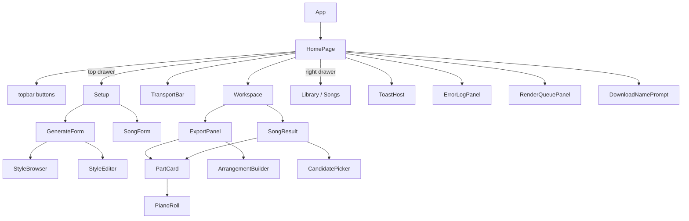

# Frontend architecture

How the GenreGrid UI is put together — the workspace shell, the design-token
system, the component/composable/service layers, and how a click becomes MIDI on
screen. Aimed at contributors touching `frontend/`.

For the *user-facing* feature list, see the [README](../README.md). For the
design decisions behind the July 2026 redesign, this doc is the canonical source.

---

## At a glance

- **Vue 3** (`<script setup>` + Composition API) · **TypeScript** · **Vite**
- **Tone.js** + **@tonejs/midi** for in-browser playback and WAV rendering
- **Electron** wrapper for the desktop app (backend spawned as a child process)
- No router, no Vuex/Pinia — a single page, with **shared state living in
  module-scoped composables** (see [Composables](#composables))
- Talks to the FastAPI backend over plain `fetch` through one service module
  (`services/api.ts`)

```
frontend/src/
├── main.ts              # bootstrap: Tone context, error handlers, debug HUD, mount
├── App.vue              # global CSS (buttons, .setup-form primitives) + <HomePage/>
├── pages/
│   └── HomePage.vue     # the whole app shell: topbar / workspace / transport / drawers
├── components/          # 20 feature components (forms, results, panels, piano roll…)
├── composables/         # shared state + behavior (player, theme, toasts, queues…)
├── services/api.ts      # every backend call
├── soundfonts/          # instrument → sampler/synth mapping + the Tone audio graph
├── styles/themes.css    # the design-token system (the single source of visual truth)
└── types/midi.ts        # request/response contracts shared with the backend
```

---

## Bootstrap (`main.ts`)

`main.ts` runs before the app mounts and does four things that must happen early:

1. **Audio context** — installs a Tone.js context with a larger-than-default
   audio buffer (`latencyHint: 0.3`). The heavy synth graph underruns Tone's
   low-latency default and glitches; the bigger buffer trades a little latency
   (fine for a player) for a clean render.
2. **Error capture** — `installGlobalErrorHandlers()` plus a Vue
   `app.config.errorHandler` funnel everything into `useErrorLog`, which backs
   the in-app **🐛 error panel**.
3. **Debug HUD** — a fixed overlay that mirrors `console.*` for diagnosing the
   *packaged* app without DevTools (toggle **Ctrl/Cmd+Shift+D**).
4. **Theme pre-apply** — importing `composables/useTheme` applies the persisted
   theme to `<html data-theme>` before first paint, so there's no flash.

`App.vue` is deliberately thin: it renders `<HomePage/>` and hosts the **global
CSS** — the button system, the `.setup-form` layout primitives, and shared type
helpers. Everything else is component-scoped.

---

## The shell (`pages/HomePage.vue`)

`HomePage.vue` *is* the application layout. One CSS grid pinned to the viewport:

```
┌─────────────────────────────────────────────┐
│ topbar   (Setup · Library/Songs · theme · ?) │  auto
├─────────────────────────────────────────────┤
│ workspace  ← the ONLY scroll region          │  1fr
│   · ExportPanel   (loop / arrangement)        │
│   · SongResult    (full song)                 │
├─────────────────────────────────────────────┤
│ TransportBar  (always docked)                 │  auto
└─────────────────────────────────────────────┘
```

Two **drawers** slide over the shell instead of adding side rails (this was a
deliberate move to kill the multi-scrollbar feel of the old layout):

- **Setup** — a wide sheet from the **top**, holding the mode picker + the active
  form (`GenerateForm` or `SongForm`).
- **Library / Songs** — a rail from the **right**, holding recent songs or the
  saved-generation library.

A single `drawer` ref (`'setup' | 'library' | null`) drives both, with a shared
scrim. `Esc` closes whatever's open.

### The three generation modes

The `mode` ref (`'loop' | 'arrangement' | 'song'`) is the top-level switch. It
lives in the **Setup drawer** as a "What do you want to make?" card row — *not*
in the topbar, because the bare words didn't explain themselves. `mode` decides:

| `mode`        | Form in Setup   | Workspace panel | Backend call        |
|---------------|-----------------|-----------------|---------------------|
| `loop`        | `GenerateForm`  | `ExportPanel`   | `generate` (1 section) |
| `arrangement` | `GenerateForm`  | `ExportPanel`   | `generate` (arc)    |
| `song`        | `SongForm`      | `SongResult`    | `buildSong`         |

`HomePage` owns the **generation history** (loop/arrangement results, capped at
50 with pinned entries kept), the **song history** (reconciled against the server
on load — see `syncSongsFromServer`), starred/pinned ids, and session
save/load. All of it persists to `localStorage` and survives reloads.

---

## Design-token system (`styles/themes.css`)

`themes.css` is the single source of visual truth. New UI should reach for these
tokens, not hard-coded colors or bespoke per-component CSS.

**Primary tokens**

- Surfaces: `--ground / --sunken / --raised`, hairlines `--line / --line-soft`
- Ink: `--ink / --ink-dim / --ink-faint`
- Accent: one `--accent` (+ `--accent-ink / --accent-wash / --accent-edge`)
- Semantic: `--good / --warn / --bad`; section hues `--seg-*` (the song-timeline
  block colors)
- Type scale (base 14px): `--t-display | title | body | meta | micro`
- Spacing `--s1..s7`, radii `--r-sm | md | lg`

> The older `--panel / --surface / --text-* / --accent-surface` names are kept as
> **aliases** mapped onto the new palette, so legacy components re-skin for free.
> New code should use the primary tokens.

**Themes** — `light`, `dark`, `whimsical` ("Sunset"). The app defaults to the OS
(`prefers-color-scheme`) on first load, then `useTheme` writes
`<html data-theme="…">`, which must (and does) beat the media query. The header
toggle cycles the three explicit themes — there is intentionally **no "system"
cycle stop** (it resolved to whichever of light/dark matched the OS and read as a
no-op). `themeColor(token)` reads a token's computed value for canvas code that
can't use `var()` (the piano roll's 2D canvas).

**Buttons** (global in `App.vue`): `.btn-primary` (one per context, solid
accent), `.btn` (outline default), `.btn-quiet` (ghost), plus `.btn-sm` and
`.btn-icon` modifiers. Convention: **`▶` means playback only** — never a
build/generate action.

**Setup-form primitives** (global in `App.vue`): a form gets `.setup-form`, then
a `.setup-grid` of three `.group`s — **Sound / Form / Feel**, each led by an
`.eyebrow` — with rarely-touched controls behind a `<details class="advanced">`.
Both `GenerateForm` and `SongForm` share this skeleton.

---

## Components

Presentational + feature components under `components/`. Roughly by role:

| Component | Role |
|---|---|
| `GenerateForm.vue` | Loop/arrangement setup form (Sound/Form/Feel), emits `submit`/`batch` |
| `SongForm.vue` | Full-song setup: template or custom section list, per-section style, melody upload |
| `ExportPanel.vue` | Loop/arrangement results list — history, quality, seed, per-part stems |
| `SongResult.vue` | The song workspace hero: section timeline, progression, part rows, re-roll/history |
| `PartCard.vue` | One stem as a hairline row — play, re-roll, lock, gain, drag-to-DAW, WAV |
| `PianoRoll.vue` | Canvas note view; click-to-select + keyboard note editing |
| `TransportBar.vue` | Docked transport — play/stop/loop, seek, per-part mute/solo, volume |
| `StyleBrowser.vue` / `StyleSelector.vue` | Style picker — category filter, pins, one-click audition |
| `StyleEditor.vue` / `StyleRadar.vue` | Tweak a style's params / visualize its profile |
| `LibraryPanel.vue` | Saved high-scoring generations, re-playable |
| `ArrangementBuilder.vue` | Stitch saved generations into an arrangement export |
| `CandidatePicker.vue` | Pick among re-rolled song-part candidates |
| `QualityBadge.vue` | The 0–1 score chip + label (unit-tested) |
| `RenderQueuePanel.vue` | WAV render jobs (progress from anywhere) |
| `ErrorLogPanel.vue` | The 🐛 session error log with stack traces |
| `ToastHost.vue` / `DownloadNamePrompt.vue` | Toast notifications / rename-before-download dialog |

---

## Composables

The app has **no store**. Instead, each composable defines its reactive state at
**module scope** (outside the `useX()` function), so every caller shares one
instance — a lightweight singleton pattern. Import `useX()` anywhere and you're
reading/writing the same refs.

| Composable | Owns |
|---|---|
| `useMidiPlayer` | The Tone.js playback engine — parses MIDI, schedules notes per part, exposes `currentlyPlaying`, transport position, mute/solo, WAV offline-render, sampler prefetch. The biggest one. |
| `useTheme` | Current theme, `cycleTheme`/`setTheme`, `themeColor()`, `data-theme` application |
| `useRenderQueue` | Background WAV render jobs + the queue panel state |
| `useStyleCatalog` | Cached style list; `instrumentLabel()` / `voiceFor()` lookups for the UI |
| `useToasts` | The toast list + `success`/`error` helpers |
| `useErrorLog` | Session error entries; `logError()` + global handler install |
| `useDownloadPrompt` | The "name your file" dialog state shared by every download path |

`PLAYER_PARTS` in `useMidiPlayer` (`drums, bass, chords, melody, arpeggio, pads,
counter_melody`) is the canonical part order used across the player and mixers.

---

## Service layer (`services/api.ts`)

One module wraps every backend call; components never `fetch` directly.

**Base URL resolution** (in order):
1. Electron desktop app → `http://127.0.0.1:<electronAPI.apiPort>` (the port the
   spawned backend reported)
2. `VITE_API_URL` env override
3. `http://localhost:8000` (dev default)

**Endpoint groups**

- **Generate** — `fetchStyles`, `generate` (with an attempt-progress callback),
  `batchGenerate`, `regeneratePart`
- **Song build** — `buildSong`, `buildSongFromMelody`, `listSongs`,
  `rebuildSongProgression`
- **Song editing** — `regenerateSongPart`, `rollSongPartCandidates` /
  `keepSongPartCandidate`, `regenerateSongSection`, `setPartGain` (mixer),
  `editPart` (note edits), `undoSongPart`
- **Versioning** — `listSongVersions`, `restoreSongVersion`
- **Library / styles** — `saveToLibrary`, `fetchLibrary`, `fetchLibraryCounts`,
  `fetchStyleDetail`, `saveCustomStyle`
- **Download helpers** — `downloadUrl`, `bundleUrl`, `sectionsUrl`,
  `arrangeDownload`

Request/response shapes live in `types/midi.ts` and are the contract with the
backend (`GenerateRequest/Response`, `BuildSongRequest/Response`,
`SongSectionResult`, `QualityScore`, `FileInfo`, `LibraryEntry`, …).

---

## Audio pipeline (`soundfonts/`)

Playback is style-aware. `soundfonts/loader.ts` builds the shared Tone graph —
a master compressor fed by separate **melodic / bass / drum buses** (electronic
styles add a sidechain pump so each kick ducks the mix). The mapping modules pick
a voice per part per style:

- `melodic.ts` — chords / melody / arpeggio instrument
- `bass.ts` — bass instrument
- `drums.ts` + `synthDrums.ts` — sampled kit or synthesized drums
- `useMidiPlayer` decides sample-vs-synth via `SYNTH_STYLES`,
  `MELODIC_SYNTH_STYLES`, `PAD_STYLES`, `LOFI_STYLES`

Pads and counter-melody always play through dedicated voices regardless of style.
The same graph is used for live preview **and** offline WAV export, so exports
match what you hear.

---

## Data flow: a loop, click to screen

```mermaid
sequenceDiagram
    participant U as User
    participant SF as GenerateForm
    participant HP as HomePage
    participant API as services/api.ts
    participant BE as FastAPI backend
    participant WS as ExportPanel + player

    U->>SF: adjust Sound/Form/Feel, click Generate
    SF->>HP: emit('submit', GenerateRequest)
    HP->>API: generate(req, onAttempt)
    API->>BE: POST /generate
    BE-->>API: GenerateResponse (files, quality, seed)
    API-->>HP: result
    HP->>HP: prepend to history (localStorage), closeDrawer()
    HP->>WS: render result; prefetch samplers
    U->>WS: press ▶ → useMidiPlayer schedules the stems
```

A **full song** follows the same shape through `SongForm → buildSong →
SongResult`, but the result is a `BuildSongResponse` with per-section quality and
markers, and `SongResult` adds re-roll, per-section regenerate, the mixer, note
editing, and version history — each editing call snapshots the song first so
History can restore it.

## Component tree



---

## Electron integration points

The renderer stays a plain web app; it only reaches into Electron when
`window.electronAPI` exists:

- **Backend port** — `electronAPI.apiPort` sets the API base URL (the packaged
  app spawns the backend on a free port and reports it).
- **Updates** — `electronAPI.checkForUpdates()` powers the topbar **Updates**
  button (Windows/Linux auto-update; macOS unsigned → "See Releases").
- **Drag to DAW** — `PartCard`'s drag handle uses the desktop file-drag bridge to
  drop a real `.mid` into your DAW.

Everything degrades gracefully in the browser (`isElectron` guards).

---

## Conventions for contributors

- **Use the tokens.** Colors/spacing/type come from `themes.css`; if you need a
  new token, add it there rather than a one-off value.
- **Use the button + form primitives** (`.btn*`, `.setup-form`/`.setup-grid`/
  `.group`/`.advanced`) instead of new scoped button/layout CSS.
- **`▶` is playback only.** Build/generate actions use `.btn-primary` with a word.
- **New backend call?** Add it to `services/api.ts` and type it in
  `types/midi.ts`; don't `fetch` from a component.
- **Shared state?** Add a module-scoped composable, matching the existing
  singleton pattern — don't reach for a store.
- **Adding a style's playback voice?** Update the `soundfonts/*` maps (and the
  `*_STYLES` sets in `useMidiPlayer` if it's synth-based) — see the README's
  [Adding a style](../README.md#adding-a-style).

---

*Screenshots in the README were captured from the Dark theme via a headless
Electron pass over the dev server; the shell, tokens, and flows above are what
they show.*
